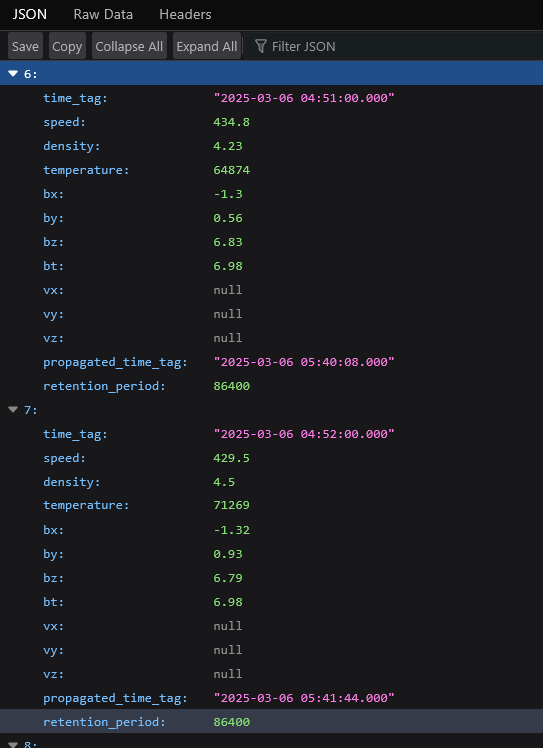

# solar-storms
A data pipeline to track solar and predict solar storms.

### How to get this code
Clone the repository by running:

```
$ git clone https://github.com/raymenzel/solar_storms.git
$ cd solar_storms
```

### How to install this code.
To install this code in a virtual environment, run:

```
$ python3 -m venv env
$ source env/bin/activate  # if in bash.
$ pip install --upgrade pip
$ pip install .
```

### How to run server.
Before starting the server for the first time, the database must be
initialized.  For now, the database just uses `sqlite3`.  The path
to the database controlled using an environment variable, which must
always be set before the server is run:

```
$ export SOLAR_STORMS_DATABASE="<path to sqlite file>"  # if in bash.
```

Once that environment variable is set, the database can be initialized by running:

```
$ python3 -m flask --app solar_storms init-db
```

Now, a development server can be started at 127.0.0.1:5000 with flask by running:

```
$ python3 -m flask --app solar_storms run
```

This application downloads realtime solar wind data from the NOAA/DSCOVR
satellite every minute and stores it in its database.  The retention time
that the data stays in the database can be configured (see below).  A simple
REST API is set up to make this data accessible.  It can be accessed by
visiting the `/api/solar-wind` route. In the near future, I hope to add
a dashboard to the applications home page.

### Accessing in the REST API.
A simple REST API is available via the `api/solar-wind` route.  It allows
users to query the database, and pass in certain arguments.



Currently, only two arguments are supported: `time_begin` and `time_end`.  These
allow uses to filter to only records that exist in that time range by visiting:

```
http://127.0.0.1:5000/api/solar-wind?time_begin=2025-03-06_04:51:00&time_end=2025-03-06_04:55:00
```
As shown [here](solar_storms/rest_api.py), many more arguments can be added as
desired.

### How the data pipeline is designed.
The data pipeline follows the ETL (extract-transform-load) paradigm.  An abstract
base class is provided [here](solar_storms/data_pipeline.py).  The
idea is that for each data source, a class can be made that inherits
from this type and the methods can be overridden as necessary.  The
`extract` method is responsible for gathering the necessary data from
the data source.  The `transform` method is responsible for cleaning
and transforming the data so that is compatible with how this application will
use it.  Lastly, the `load` method is responsible for loading the
data into this application's database.  For simplicity (and due to
the relatively small amount of data that is currently being processed),
an sqlite3 database is currently used.  In a real production environment,
this would be transitioned to an actual database server.  The data pipelines
can be configured to run on a set schedule.  Currently, the application's
data pipeline for [NOAA's DSCOVR realtime solar wind data](solar_storms/noaa_dscovr.py)
is configured to run every minute.

The general for process for adding a new data pipeline is:
1.) Add a new table to the [database schema](solar_storms/schema.sql).
2.) Add to the database (manually for now).
3.) Create a new python class that inherits from the `DataPipeline` class.
4.) Override the `extract`, `transform`, and `load` methods.
5.) Set the schedule for when the data pipeline will be refreshed.

### Example: NOAA/DSCOVR
As an example, please review the [NOAA's DSCOVR realtime solar wind data pipeline](solar_storms/noaa_dscovr.py)
You will see [here](solar_storms/__init__.py) that it is scheduled to run every 60 seconds.
